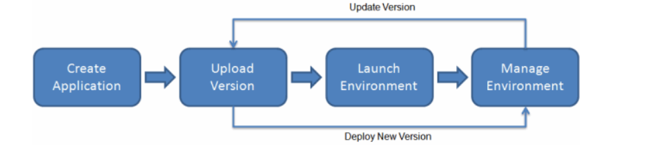
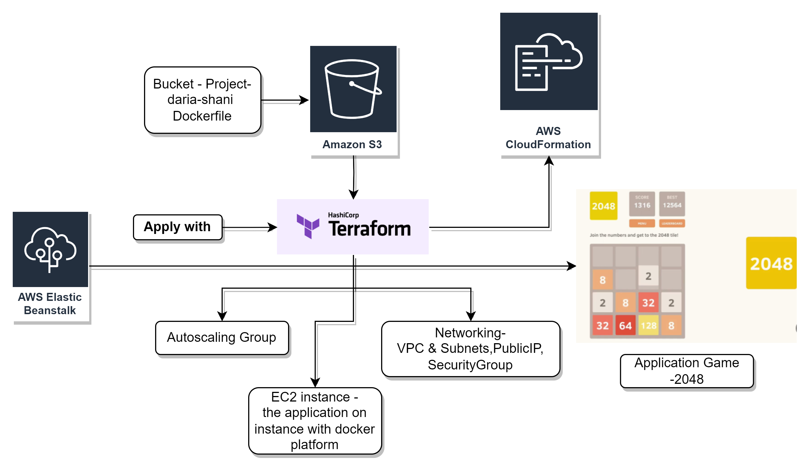

# **AWS - Elastic Beanstalk Service**

AWS Elastic Beanstalk helps to quickly deploy and manage applications in the AWS Cloud without having to worry about the infrastructure that runs those applications. reduces management complexity without restricting choice or control.

enables automated infrastructure management and code deployment, by simply uploading, for applications and includes Application platform management, Capacity provisioning, Load Balancing, Auto Scaling, Code deployment, Health Monitoring.

Elastic Beanstalk environment requires an environment tier, platform, and environment type. Environment tier determines whether EB provisions resources to support

  1.Web tier – a web application that handles HTTP(S) requests    
  2.Worker tier – an application that handles background-processing tasks.

# **The Project - Application web game-2048**

  1.Create a dockerfile with source code application.
  2.Create a bucket in region and upload the Dockerfile to bucket.
  3.Deploy the application with Terraform.
  4.Enjoy the application.

**# AWS - CloudFormation service**

AWS CloudFormation is a service that gives developers and businesses an easy way to create a collection of related AWS and third-party resources, and provision and manage them